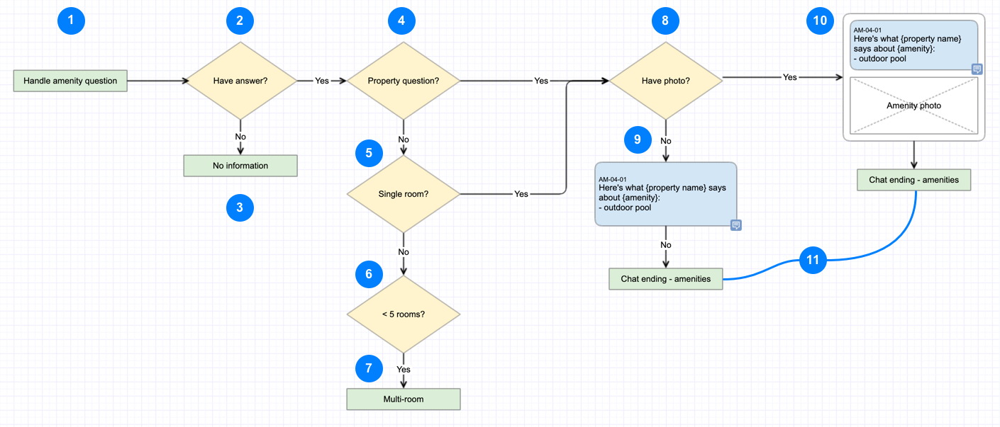

---

title: CDS basics - Flow design
description: Learn how to design a skill for the VAC
type: documentation
page_order: 64
show_in_navbar: false
slug: basic-flow

---

import Notification from '../../src/components/notification.js'
import ExternalLink from '../../src/components/external-link.js'
import PageFooter from '../../src/components/page-footer.js'

The flow diagram is a **step-by-step visualization of how to fulfill the project requirements**. The flow diagram should document the inputs, decision points and the different routes a conversation might take within your skill. The flow diagram is the simplest way to document the speech that the VA display to the customer as it moves through the process.

<Notification headerText="What your will learn in this section" textColor="#00001e" borderColor="#999" icon="learn" backgroundColor="#f0f0f0">

- Conventions for creating flow diagrams in the Conversation Design System
- Strategies for modularization and reuse
- Working with the content strategist
- Adding conversation codes

</Notification>

### Flow diagram best practices

- Visit  <ExternalLink linkName="Learn About Flows" linkURL="https://confluence.expedia.biz/display/GCOUX/*+Learn+About+Flows" /> in the Flow Maps to see the styles and conventions for creating a flow map.
- Visit <ExternalLink linkName="How to Create Flows" linkURL="https://confluence.expedia.biz/display/GCOUX/How+to+Create+Flows" /> to find out how to create a modular flow page and for best practices in creating Gliffy flows.
- **Try to break down your interaction into the smallest self-contained modules possible.** 
  - *Like Russian nesting dolls, little components are included in bigger components which are included in bigger components which eventually create entire (flows). — Brad Frost*
  - See Brad Frost's <ExternalLink linkName="Atomic Design" linkURL="https://bradfrost.com/blog/post/extending-atomic-design/" />.
- Review <ExternalLink linkName="Flow maps" linkURL="https://confluence.expedia.biz/display/GCOUX/Flows" /> to see if any of the modules that make up your interaction already exist.
  - If you identify parts of your flow that already exist in the library, you can abstract them as skills (green boxes) in your flow design and don't need to repeat that interaction.
  - **Review the node and connection types** described in <ExternalLink linkName="Flow symbols" linkURL="https://confluence.expedia.biz/display/GCOUX/Flow+Symbols" /> and build your flow out accordingly.
- **Work with content strategist to begin laying in customer interactions**
  - What does the VA tell the customer 
  - What information is needed at each step
  - Insure that the voice and tone of the VA is correct.
- Work with development to make sure that all edge and error cases are documented.  

<Notification headerText="Map out the basic flow" textColor="#333399" icon="example" backgroundColor="#eeeeff">

  

  1. Start flow by identifying the skill - for authenticated customer
  2. Does the hotel provide us with this amenity information
  3. If not, transfer to the 'No information' skill
  4. If the hotel does provide this type of information is it at the property level or the room level?
  5. If it's at the room level, is the booking a single room?
  6. If its for multiple rooms, is it for fewer than 5 rooms?
  7. If it is for 5 or more rooms, transfer to the 'Multi-room skill'
  8. If the info is at the property level or its a single room booking, do we have a photo for the amenity?
  9. If no photo, the VA responds with a conversational bubble
  10. If there is a photo, display the answer and photo in a card
  11. Transfer to the 'Chat ending' skill.

</Notification>
  
<Notification headerText="Review your designs" textColor="#663333" icon="review" backgroundColor="#ffeeee">

- Review your designs with the stakeholders identified in the <ExternalLink linkName="Virtual Agent Platform Innersource Model" linkURL="https://confluence.expedia.biz/display/VAP/Virtual+Agent+Platform+Innersource+Model" /> page. 

- The links on the left side, to the individual Innersource projects will lead to project pages that identify the stakeholders and representatives of different disciplines.

</Notification>

- Review flows with development, product management and stakeholders
  - **Once the flows are approved**:
    - Work with content strategist to ensure <ExternalLink linkName="Content codes" linkURL="https://confluence.expedia.biz/display/GCOUX/How+to+Insert+Content+Codes" /> have been added to the interactions
    - Add your flow to the Library so that other designers and product managers can benefit from your work.

<PageFooter prevSlug="/basic-conversation" prevPage="Conversational fit?" nextSlug="/basic-design" nextPage="Visual design" />
