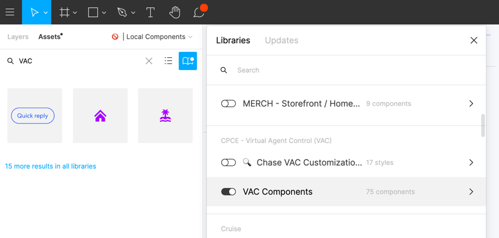

---

title: CDS basics - Visual design
description: Learn how to design a skill for the VAC
type: documentation
page_order: 64
show_in_navbar: false
slug: basic-design

---

import Notification from '../../src/components/notification.js'
import ExternalLink from '../../src/components/external-link.js'
import PageFooter from '../../src/components/page-footer.js'
import MoveFlag from '../../src/components/move-flag.js'

While the flow diagram can demonstrate the logic of your solution, its important to see how the conversation will appear to the customer.

- How does it feel to interact with your conversation design?
- Do the VA responses fit on a single screen or will the customer need to scroll?
- Does the number of buttons overwhelm the customer?
- Do they stack so that they can all be seen at once? 

<Notification headerText="What your will learn in this section" textColor="#00001e" borderColor="#999" icon="learn" backgroundColor="#f0f0f0">

- Adding the Conversation design library to your Figma file
- Creating and using a transcript for your design
- Commonly used conversational components

</Notification>

## Getting started

- Refer to (and even use!) the <ExternalLink linkName="CDS Starter Figma file" linkURL="/" />
- Add <ExternalLink linkName="VAC Components" linkURL="https://www.figma.com/file/vjBUZSellUT1M5eZnfp087/VAC-Components?node-id=463%3A8833" /> as a Library Asset to your Figma file.

## Best practices for building out a skill

  - Review the <ExternalLink linkName="best practices" linkURL="" /> for designing interactions with the VA.
    - On the page linked above we list best practices for interactions between the VA and a customer or agent. 
  - Create a <ExternalLink linkName="transcript component" linkURL="https://www.figma.com/file/bXYsRa3eAw4TMWb56yPJXs/How-to%3A-build-a-transcript?node-id=0%3A1" /> for each of your project's scenarios.
    - On the page linked above we describe an efficient method of laying out a conversation in Figma so that you can easily show each stage of the conversation for your comps or prototype.
  - A simple skill, such as the one we're building in this tutorial, can consist entirely of text messages between the VA and customer or agent as well as Quick Reply buttons to help direct the conversation:
    - <ExternalLink linkName="Message bubbles" linkURL="http://figma.com/file/vjBUZSellUT1M5eZnfp087/VAC-Components?node-id=5826:0" /> for incoming and outgoing messages

    - <ExternalLink linkName="Quick reply buttons" linkURL="http://figma.com/file/vjBUZSellUT1M5eZnfp087/VAC-Components?node-id=6184:90738" /> to suggest options to the customer or agent.

Lets see how the <ExternalLink linkName="conversation design" linkURL="/basic-flow" /> that we created back on the Flow diagram page page will translate to a Figma transcript:

<Notification headerText="Transcript of our basic conversation" textColor="#333399" icon="example" backgroundColor="#eeeeff">

<!-- <MoveFlag message="Need Figma transcript of basic conversation here" /> -->

</Notification>

In the advanced conversation tutorial, we will also discuss:
- <ExternalLink linkName="WebViews" linkURL="/" />
- <ExternalLink linkName="Declarative cards" linkURL="/" />

  - Refund status
  - Forms
  - Tabular information

## Accessibility

For a basic, purely conversational skill, the conversation platform itself will ensure that the interaction is accessible to all users but as we move on to more advanced skills it will be important to review and implement the <ExternalLink linkName="Accessibility Guidelines" linkURL="https://www.figma.com/file/vjBUZSellUT1M5eZnfp087/VAC-Components?node-id=5906%3A0" /> that are a part of the <ExternalLink linkName="VAC Components Library" linkURL="https://www.figma.com/file/vjBUZSellUT1M5eZnfp087/VAC-Components?node-id=463%3A8833" />.

<Notification headerText="Review your designs" textColor="#663333" icon="review" backgroundColor="#ffeeee">

- Consider adding a <ExternalLink linkName="Silent Crit" linkURL="https://www.figma.com/file/S1KDX9Zy7e3c3UfZYM9NB9/%F0%9F%95%B9Silent-Crit-%3A-Feedback-Kit?node-id=28%3A2335" /> component to your file and posting your design to Slack for feedback from your team.
- Review your designs with the stakeholders identified in the <ExternalLink linkName="Virtual Agent Platform Innersource Model" linkURL="https://confluence.expedia.biz/display/VAP/Virtual+Agent+Platform+Innersource+Model" /> page. 

- The links on the left side, to the individual Innersource projects will lead to project pages that identify the stakeholders and representatives of different disciplines.

</Notification>

<PageFooter prevSlug="/basic-flow" prevPage="Flow design" nextSlug="/basic-test" nextPage="Testing" />