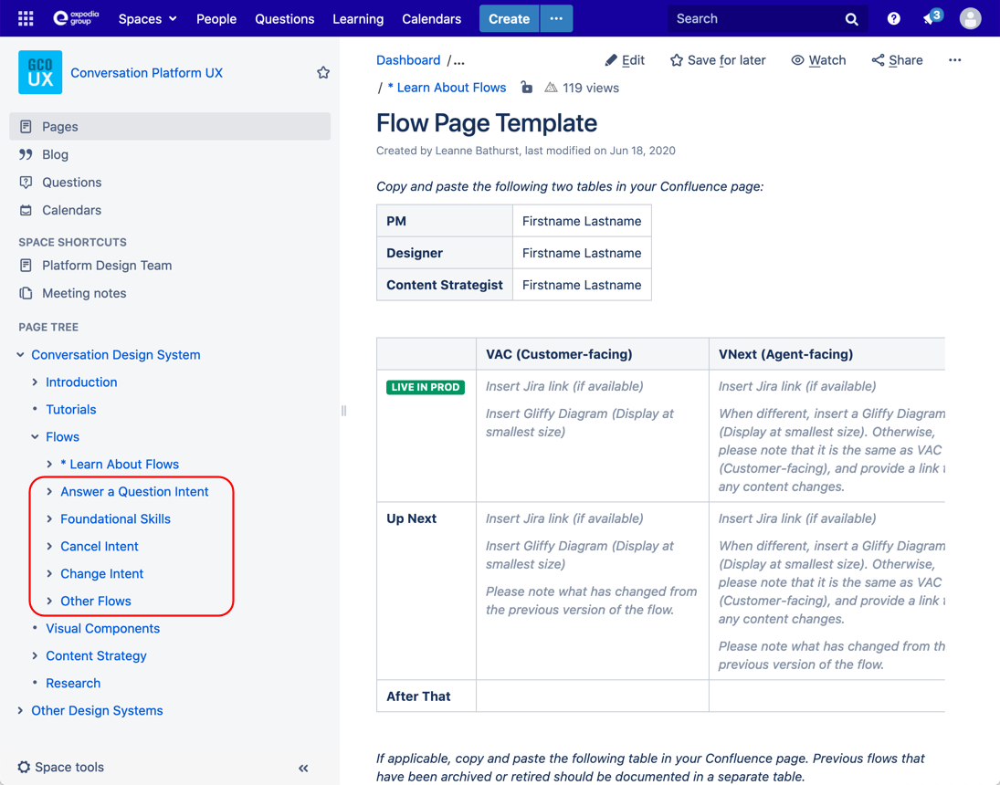
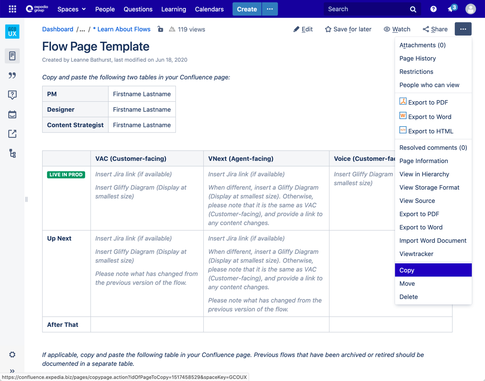
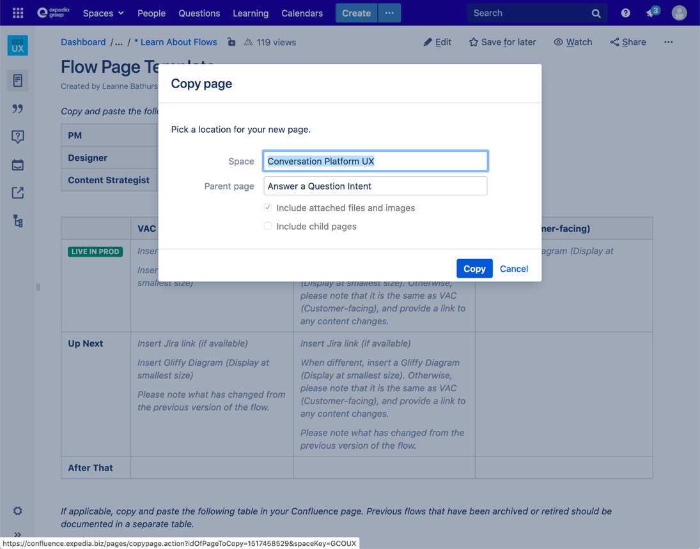

---

title: CDS basics - Hand off your design
description: Learn how to design a skill for the VAC
type: documentation
page_order: 66
show_in_navbar: false
slug: basic-handoff

---

import Notification from '../../src/components/notification.js'
import ExternalLink from '../../src/components/external-link.js'
import PageFooter from '../../src/components/page-footer.js'
import TutorialStep from '../../src/components/tutorial-step.js'

The thinking and effort that went into your project could be used by other teams. To enable and encourage reuse, add your project to the Conversation Design System documentation. 

<Notification headerText="What your will learn in this section" textColor="#333366" icon="learn" backgroundColor="#eeeeff">

- Add your flow diagram to Flows documentation
- Linking your designs to the Jira ticket
- Add your research to the CDS research hub
- Reviewing the designs with the development team

</Notification>

## Add your flow diagram to the Flows documentation

To add your flow diagram to the Flows directory in the CDS, first go to the <ExternalLink linkName="Flow Page Template" linkURL="https://confluence.expedia.biz/display/GCOUX/Flow+Page+Template" />. You can copy and paste the tables on this page to your own confluence page or you can copy this page directly into one of the flow categories within the Flows directory.

<TutorialStep stepNum="1" stepText="Decide which parent category you'd like your flow to live in:" />

<TutorialStep stepNum="2" stepText="Select 'Copy' from the kebab menu on the upper right of the flow page template:" />

<TutorialStep stepNum="3" stepText="Fill in the modal form to create a new page and copy the template over:" />

## Document your components in the UDS

Follow the guidlines laid our in the <ExternalLink linkName="UDS Component Contruction Guide" linkURL="https://paper.dropbox.com/doc/UDS-Component-Construction-Guide--A5DU0DbmfInvxoQIDZXmre3HAg-Rl71XUcT2DIsOw5nqXIIO" />

## Link your designs to the Jira ticket

## Add your research to the CDS research hub

<PageFooter prevSlug="/basic-test" prevPage="Testing" />

