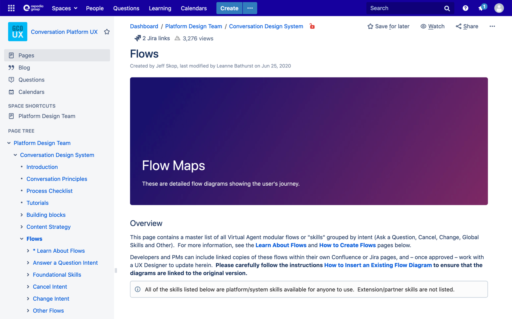
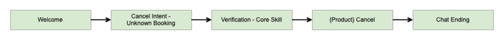
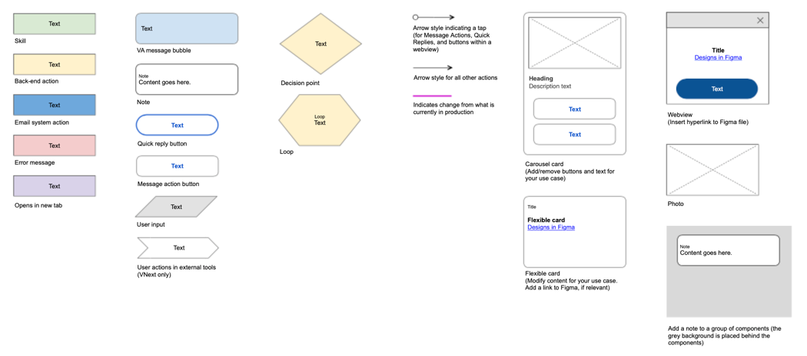
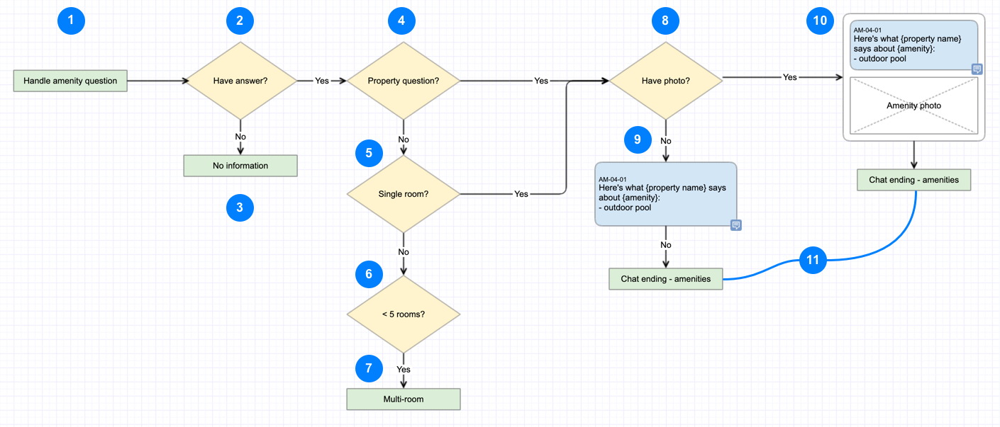
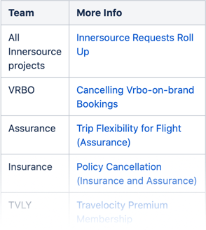
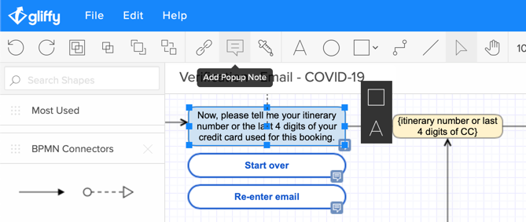

import ExternalLink from "../../src/components/external-link.js"
import PageFooter from "../../src/components/page-footer.js"
import TutorialStep from "../../src/components/tutorial-step.js"

The flow diagram is a **step-by-step visualization of how to fulfill the project requirements**. The flow diagram should document the inputs, decision points, routes and outputs a conversation might take within your skill. The flow diagram is the simplest way to document all of the possible interactions between the customer and Virtual Assistant in your skill. The flow diagram is invaluable for the developers building the skill as it should document all possible interactions and contain the final content that the VA will display to customers.

## 1. Flow diagram best practices

### Find the fundamental building blocks

- For background, have a look at <ExternalLink linkName="Atomic Design" linkURL="https://bradfrost.com/blog/post/atomic-web-design/" /> by Brad Frost. 
- Attempt to identify the fundamental interactions that make up your skill.

### Build on the work of other teams
- Review the library of existing <ExternalLink linkName="Flow maps" linkURL="https://confluence.expedia.biz/display/GCOUX/Flows" /> to see if any of the modules that make up your interaction already exist.

<figcaption>The Flow directory page lists every VA skill in production</figcaption>

- If you identify parts of your flow that already exist in the library, you can abstract them as skills (green boxes) in your flow design and don't need to repeat that interaction.

<figcaption>Utilize skills from other teams to build your own flow.</figcaption>

- **Review the node and connection types** available in <ExternalLink linkName="Flow symbols" linkURL="https://confluence.expedia.biz/display/GCOUX/Flow+Symbols" /> and build your flow out accordingly.

<figcaption>Node types to build a conversational skill</figcaption>

- Visit <ExternalLink linkName="Learn About Flows" linkURL="https://confluence.expedia.biz/display/GCOUX/*+Learn+About+Flows" /> in the Flow Maps to see the styles and conventions for creating a flow map.

### Create a new flow for your skill

- Visit <ExternalLink linkName="How to Create Flows" linkURL="https://confluence.expedia.biz/display/GCOUX/How+to+Create+Flows" /> to find out how to create a modular flow page and for best practices in creating Gliffy flows.
- **Work with content strategist to begin laying in customer interactions**
  - What does the VA tell the customer
  - What information is needed at each step
  - Insure that the voice and tone of the VA is correct.
- Work with development to make sure that all edge and error cases are documented.

## 2. Tutorial: Basic skill flow

We can lay out the basic flow that a customer might follow in asking for lodging amenities information. Initially we work with the primary decision points and 

<figcaption>Basic flow for lodging amenities questions (including check-in time)</figcaption>

<TutorialStep>

1. Start flow by identifying the skill - for authenticated customer
2. Does the hotel provide us with this amenity information?
3. If not, transfer to the 'No information' skill
4. If the hotel does provide this type of information is it at the property level or the room level?
5. If it's at the room level, is the booking a single room?
6. If it's for multiple rooms, is it for fewer than 5 rooms?
7. If it is for 5 or more rooms, transfer to the 'Multi-room skill'
8. If the info is at the property level or its a single room booking, do we have a photo for the amenity?
9. If no photo, the VA responds with a conversational bubble
10. If there is a photo, display the answer and photo in a card
11. Transfer to the 'Chat ending' skill.

</TutorialStep>

## 3. Review your designs
- Review your designs with the stakeholders identified in the <ExternalLink linkName="Virtual Agent Platform Innersource Model" linkURL="https://confluence.expedia.biz/display/VAP/Virtual+Agent+Platform+Innersource+Model" /> page.

<figcaption>Find a full list of all Innersource projects with links</figcaption>

- The links on the left side, to the individual Innersource projects will lead to project pages that identify the stakeholders and representatives of different disciplines.
### Once the flows are approved:
- Work with the development team to make sure the gliffy flow matches the technical skill graph.
- Work with content strategist to ensure <ExternalLink linkName="Content codes" linkURL="https://confluence.expedia.biz/display/GCOUX/How+to+Insert+Content+Codes" /> have been added to the interactions

<figcaption>In Gliffy, select the flow element and add a popup note with the appropriate content code</figcaption>

- Add your flow to the Library so that other designers and product managers can benefit from your work.

## 4. Next steps

<PageFooter
  prevSlug="/basic-conversation"
  prevPage="Conversational fit?"
  nextSlug="/basic-design"
  nextPage="Visual design"
/>
