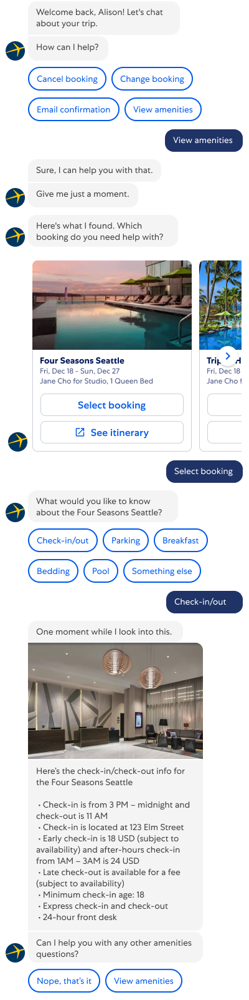
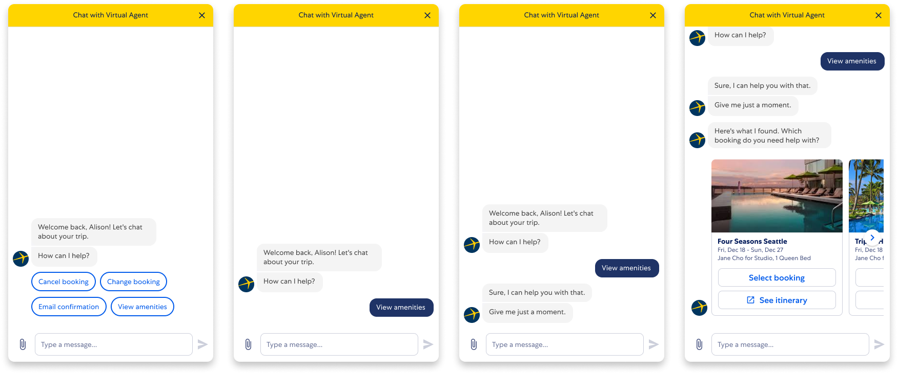
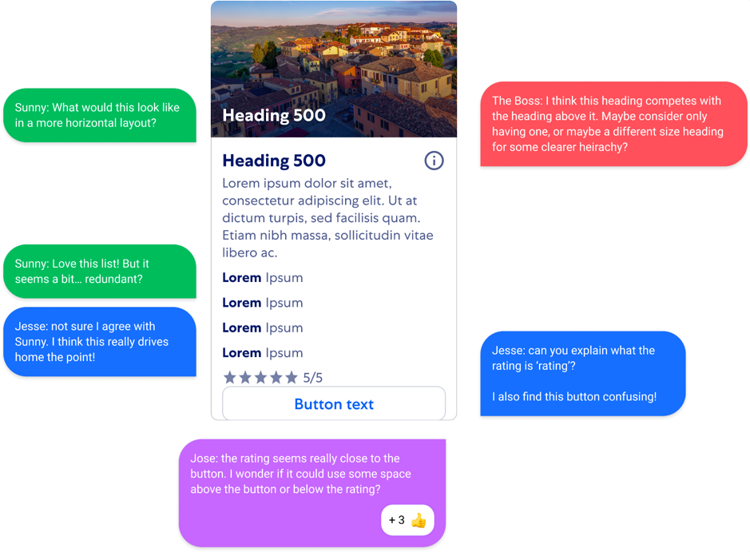

---

title: Visual design
description: Learn how to design a skill for the VAC
type: documentation
page_order: 64
show_in_navbar: false
slug: visual-design

---

import ExternalLink from '../../src/components/external-link.js'
import PageFooter from '../../src/components/page-footer.js'

While the flow diagram can demonstrate the logic of your solution, its important to see how the conversation will appear to the customer.

- How does it feel to interact with your conversation design?
- Do the VA responses fit on a single screen or will the customer need to scroll?
- Does the number of buttons overwhelm the customer?
- Do they stack so that they can all be seen at once? 

## 1. Getting started

### Design components
- Refer to (and even use!) the <ExternalLink linkName="CDS Starter Figma file" linkURL="/" />
- Add <ExternalLink linkName="VAC Components" linkURL="https://www.figma.com/file/vjBUZSellUT1M5eZnfp087/VAC-Components?node-id=463%3A8833" /> as a Library Asset to your Figma file.

<figcaption>Adding VAC components library to your setup</figcaption>

### Best practices

  - Review the <ExternalLink linkName="building blocks" linkURL="https://confluence.expedia.biz/display/GCOUX/Building+blocks" /> section of the documentation for common patterns of designing for the VA.
  - Create a <ExternalLink linkName="transcript component" linkURL="https://www.figma.com/file/bXYsRa3eAw4TMWb56yPJXs/How-to%3A-build-a-transcript?node-id=0%3A1" /> for each of your project's scenarios.
    - On the page linked above we describe an efficient method of laying out a conversation in Figma so that you can easily show each stage of the conversation for your comps or prototype.
  - A simple skill, such as the one we're building in this tutorial, can consist entirely of text messages between the VA and customer or agent as well as Quick Reply buttons to help direct the conversation:
    - <ExternalLink linkName="Message bubbles" linkURL="http://figma.com/file/vjBUZSellUT1M5eZnfp087/VAC-Components?node-id=5826:0" /> for incoming and outgoing messages

    - <ExternalLink linkName="Quick reply buttons" linkURL="http://figma.com/file/vjBUZSellUT1M5eZnfp087/VAC-Components?node-id=6184:90738" /> to suggest options to the customer or agent.

## 2. Tutorial

### Creating the happy path transcript
Lets see how the <ExternalLink linkName="conversation design" linkURL="/basic-flow" /> that we created back on the Flow diagram page page will translate to a Figma transcript:

<figcaption>Happy path for asking about a hotel's check-in time.</figcaption>

### Prototyping the interaction
Once the transcripts are complete, you can start to model the customer experience by putting a masked instance of the transcript into the VAC container. You would scroll the transcript up to reveal each new turn of the conversation.

<figcaption>The transcript is progressively revealed in each step of the prototype.</figcaption>

This prototype could be used in the <a href="/basic-test">testing section</a> that we will look at next.

### Accessibility

For a basic, purely conversational skill, the conversation platform itself will ensure that the interaction is accessible to all users but as we move on to more advanced skills it will be important to review and implement the <ExternalLink linkName="Accessibility Guidelines" linkURL="https://www.figma.com/file/vjBUZSellUT1M5eZnfp087/VAC-Components?node-id=5906%3A0" /> that are a part of the <ExternalLink linkName="VAC Components Library" linkURL="https://www.figma.com/file/vjBUZSellUT1M5eZnfp087/VAC-Components?node-id=463%3A8833" />.

## 2. Review your design

### Peer review

- Review your designs and gather feedback from your team-mates.
- Consider adding a <ExternalLink linkName="Silent Crit" linkURL="https://www.figma.com/file/S1KDX9Zy7e3c3UfZYM9NB9/%F0%9F%95%B9Silent-Crit-%3A-Feedback-Kit?node-id=28%3A2335" /> component to your file and posting your design to the #vac-us Slack channel for feedback from the VAC team.

<figcaption>Other designers can add comments and notes to your designs</figcaption>

### Stakeholder review

- Review your designs with the stakeholders identified in the <ExternalLink linkName="Virtual Agent Platform Innersource Model" linkURL="https://confluence.expedia.biz/display/VAP/Virtual+Agent+Platform+Innersource+Model" /> page. 

- The links on the left side, to the individual Innersource projects will lead to project pages that identify the stakeholders and representatives of different disciplines.

## 4. Next steps

In the advanced conversation tutorial, we will also discuss:
- <ExternalLink linkName="WebViews" linkURL="/" />
- <ExternalLink linkName="Declarative cards" linkURL="/" />

  - Refund status
  - Forms
  - Tabular information

<PageFooter prevSlug="/flows" prevPage="Flow design" nextSlug="/testing" nextPage="Testing" />